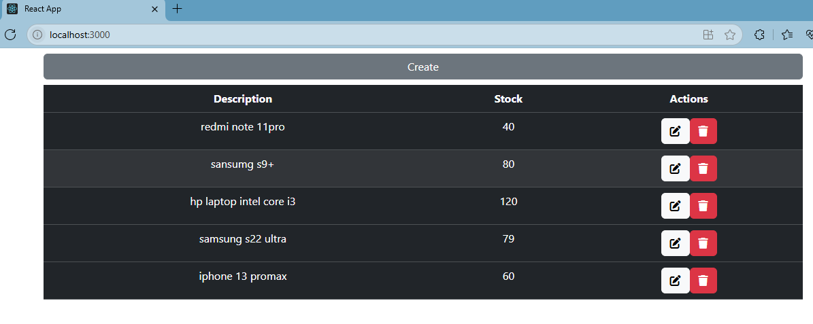

# CRUD con Firebase Firestore y React

https://miro.medium.com/v2/resize:fit:1200/1*R4c8lHBHuH5qyqOtZb3h-w.png
Aplicación CRUD (Create, Read, Update, Delete) desarrollada con React y Firebase Firestore para la gestión de productos.

## Características principales
✅ Creación de productos

✅ Visualización de lista de productos

✅ Actualización de productos existentes

✅ Integración con Firebase Firestore

✅ Routing con React Router

✅ Diseño responsive con Bootstrap

## Tecnologías utilizadas
### Frontend:
- React 19
- React Router DOM
- Bootstrap 5
- SweetAlert2 para notificaciones

### Backend:
- Firebase Firestore (NoSQL database)
- Firebase Authentication (opcional)

## Estructura del proyecto
public/
src/
├── components/
│   ├── Create.js     # Componente para crear productos
│   ├── Edit.js       # Componente para editar productos
│   └── Show.js       # Componente para mostrar productos
├── firebaseConfig/
│   └── firebase.js   # Configuración de Firebase
├── App.js            # Componente principal
├── App.css
├── index.js          # Punto de entrada
├── index.css
├── package.json
└──package-lock.json


## Configuración inicial
### Requisitos
- Node.js (v16+ recomendado)
- npm (v8+ recomendado)

- Cuenta de Firebase

## Instalación
Clonar el repositorio:
```bash
git clone https://github.com/190799-vargas/CRUD_React_Firebase_BDFirestore_Cloud_Firestore_registro_productos
```

cd crud-firestore-react
### Instalar dependencias:
```bash
npm install
```

## Configurar Firebase:
- Crea un proyecto en Firebase Console
- Copia tu configuración en src/firebaseConfig/firebase.js
- javascript
const firebaseConfig = {
  apiKey: "TU_API_KEY",
  authDomain: "TU_AUTH_DOMAIN",
  projectId: "TU_PROJECT_ID",
  storageBucket: "TU_STORAGE_BUCKET",
  messagingSenderId: "TU_MESSAGING_SENDER_ID",
  appId: "TU_APP_ID"
};

## Iniciar la aplicación:
```bash
npm start
```
## Uso de la aplicación
- Ver productos (/):
- Listado completo de productos
- Opciones para editar cada producto
- Crear producto (/create):
- Formulario con campos:
- Descripción (texto)
- Stock (número)
- Editar producto (/edit/:id):
- Formulario pre-llenado con los datos del producto
- Posibilidad de modificar descripción y stock
- Eliminar un producto

## Variables de entorno
Crea un archivo .env en la raíz con:
```bash
REACT_APP_FIREBASE_API_KEY=TU_API_KEY
REACT_APP_FIREBASE_AUTH_DOMAIN=TU_AUTH_DOMAIN
REACT_APP_FIREBASE_PROJECT_ID=TU_PROJECT_ID
REACT_APP_FIREBASE_STORAGE_BUCKET=TU_STORAGE_BUCKET
REACT_APP_FIREBASE_MESSAGING_SENDER_ID=TU_MESSAGING_SENDER_ID
REACT_APP_FIREBASE_APP_ID=TU_APP_ID
```

## Scripts disponibles
- npm start: Inicia la aplicación en modo desarrollo
- npm run build: Crea la versión de producción
- npm test: Ejecuta las pruebas
- npm run eject: Expone la configuración de webpack (irreversible)

## Despliegue
Puedes desplegar esta aplicación en:

### Firebase Hosting:
```bash
npm install -g firebase-tools
firebase login
firebase init
firebase deploy
Vercel:
npm install -g vercel
vercel
Netlify:
Conectar tu repositorio Git directamente
```

## Contribución
- Haz fork del proyecto
- Crea una rama (git checkout -b feature/nueva-funcionalidad)
- Haz commit de tus cambios (git commit -am 'Añade nueva funcionalidad')
- Haz push a la rama (git push origin feature/nueva-funcionalidad)
- Abre un Pull Request

## Licencia
MIT © Victor Alfonso Vargas Diaz